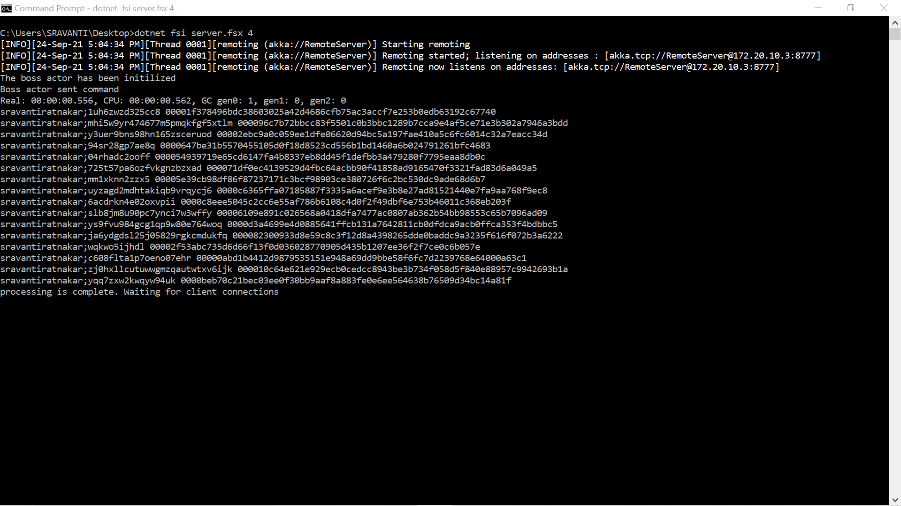
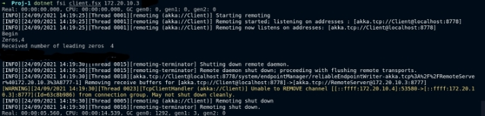
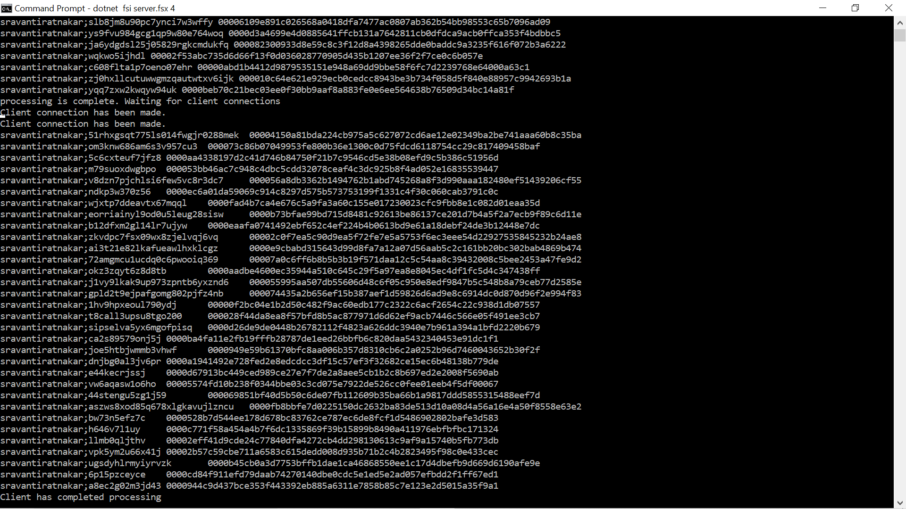
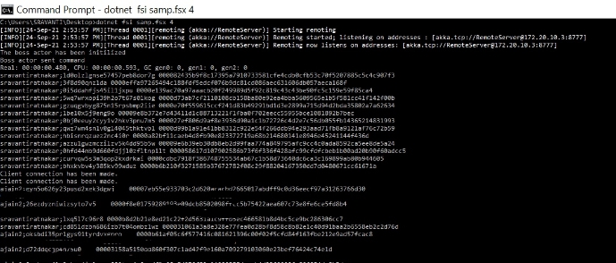

PROJECT -1

COP5615-DISTRIBUTED OPERATING SYSTEMS

AVI RAJESH JAIN-31678662

`                                                    `SRAVANTI RATNAKARAM-71233172

**PROBLEM DEFINITION**

Bitcoins (seehttp://en.wikipedia.org/wiki/Bitcoin) are the most popular crypto-currency in common use. At their heart, bitcoins use the hardness of cryptographic hashing (for a reference seehttp://en.wikipedia.org/wiki/Cryptographichashfunction)to ensure a limited “supply” of coins. In particular, the key component in a bit-coin is an input that, when “hashed” produces an output smaller than a target value. In practice, the comparison values have leading 0’s, thus the bitcoin is required to have a given number of leading 0’s (to ensure 3 leading 0’s, you look for hashes smaller than0x001000... or smaller or equal to 0x000ff....The hash you are required to use is SHA-256. You can check your version against this online hasher:<http://www.xorbin.com/tools/sha256-hash-calculator>. For example, when the text “COP5615 is a boring class” is hashed, the value 0xe9a425077e7b492076b5f32f58d5eb6824b1875621e6237f1a2430c6b77e467c is obtained. For the coins, you find, check your answer with this calculator to ensure correctness. The goal of this first project is to use F# and the actor model to build a good solution to this problem that runs well on multi-core machines.

**IMPLEMENTATION SPECIFICS**

The zip file *Project1.zip* consists of three files:

- project1.fsx-which is the implementation of the actor-model which takes *‘k’* as input (number of leading zeroes).
- client’s-which is the client implementation that takes server Ip address as input
- server.fsx-which is the server implementation that takes *‘k’* as input (number of leading zeroes)

To run project1.fsx: type dotnet fsi project1.fsx k (number of leading zeros)

**1.SIZE OF THE WORK UNIT** 

` `First, the number of logical processors on any machine (any worker) with a system call.  *let workers = (System.Environment. ProcessorCount |> int64) \*4L. For* this we looked at both the CPU utilization numbers and the time function/CPU time to real time ratio. The CPU / Real time ratio was looked at and after trying many combinations, choosing the workers to be *(System.Environment.ProcessorCount |> int64)\*4L* gave the best ratio. This was tested out on intel laptop processors (core i7).

After extensive trial and error, to avoid communication overhead, each worker generates a string and hashes it and if it has found a coin, it will provide it to the boss actor. So, the boss actor provides the worker with ‘k’

**Generation of Random Strings**: Each miner/actor generates a random string between length 9-30, which is prefixed with gatorlink ID to ensure that no two workers will work on the same string. 

**Final Input Str: <GatorLink ID> + <Variable length (9-30) random string>**

**2.RESULT OF RUNNING PROGRAM FOR INPUT 4**

**3.** **THE RUNNING TIME FOR THE ABOVE & THE RATIO OF CPU TIME TO REAL TIME** 

When project1.fsx 4 is run, the real time is 08.522 s and the CPU time is 30.359s

**RATIO (CPU / REAL TIME): 3.56**

when project1.fsx 5 is run 

**RATIO (CPU / REAL TIME): 4.87**

**4.** **THE COIN WITH THE MOST 0S** 
**
`   `The coin with most zeros, that was managed to be found was one coin with **8 leading zeros** when running the project for 7 leading zeros. The project was run for around 4 hours and it generated strings with 7 leading zeros and 1 with 8 leading zeros.

**DISTRIBUTED IMPLEMENTATION**

**5. THE LARGEST NUMBER OF WORKING MACHINES** 

Total of **3 machines** were used. One was the server, while the other 2 were clients.

- **Project1.fsx was extended to have the server implementation. The code was then saved in server.fsx**

- **When the server is run, it does its computation and if a client connects then it will send the value of ‘k’ (number of leading zeros) to the client and the client does its computation. After it is done, it will send the coins to the sever which will be printed on the server’s terminal, then the client terminates. The client can also connect mid-way during the server’s execution and the client will provide the k value to the client and both of them will do the computation parallelly.**

**SAMPLE OF THE SERVER RUNNING ON Its OWN The server was hosted at the IP address: 172.20.10.3** 

**CLIENT-SERVER RUNNING SAMPLE OUTPUT**

**The server was hosted at the IP address: 172.20.10.3** 

**The server was on port number: 8777**

**The client was on port number:8778**

**According to the project requirements the client connects to the server taking the server IP as command line argument. The port number of the server is provided in the configuration of the client.**

**SAMPLE CLIENT -1 – Client after it makes the connection with server it gets the k value with which it will carry out the execution. (This is first client)**

**SAMPLE CLIENT -2 (This is second client on different machine)**

**SERVER BEFORE CLIENT CONNECTIONS**

**SERVER AFTER CLIENT CONNECTIONS**

Printing client 1’ s output

printing client 2’s output

**CLIENT CONNECTION MIDWAY DURING THE SERVER IMPLEMENTATION SAMPLE**

**Here the client coin has the other team member’s Gatorlink ID appended to depict the difference of the server and client output coins.** 

**
**

